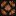
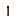
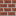
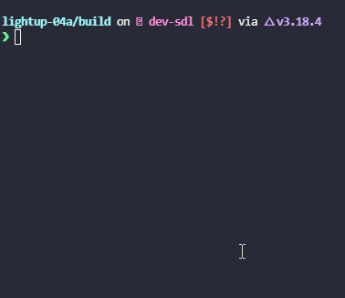
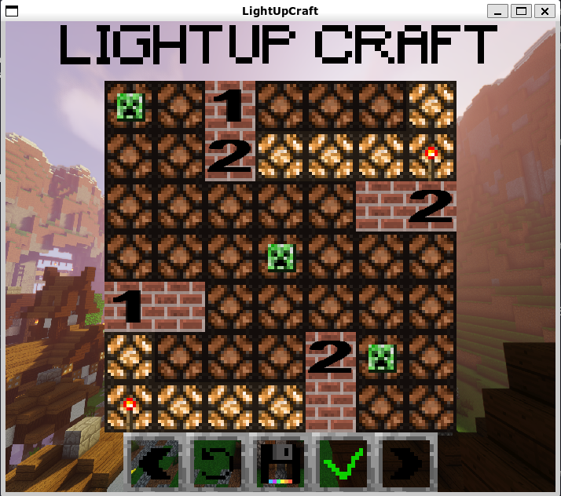
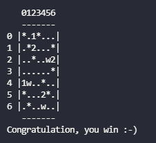
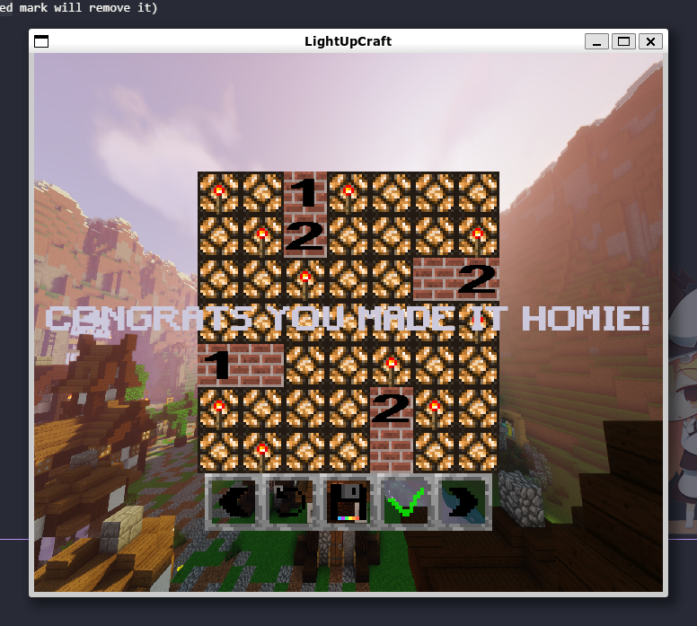

# **Lightup Craft**
This is a small one player style puzzle game, it was made with minecraft textures in mind.
made by Taif Aabo-Aljaloo and Louis Pyrondet.

## Game Rules

  

In this game you have a grid of squares. some are numbered wall squares (or without numbers).

  

The main goal is to fill the whole empty areas (squares) with light by placing a _lightbulb_ in a given free place.

  

To win the game, you must satisfy the following conditions:

  

  

- All empty squares MUST BE lit.

  

- No light is lit by another light.

  

- Each numbered wall square must be orthogonally adjacent to exactly the given number of lights.

  

- Non-numbered wall squares may have any number of lights adjacent to them.

  

You can mark a game square with a mark symbol.

  

  

All the above is represented by these symbols

  

- blank (' ') 

  

- light bulb ('*') , two lightbulbs that are looking at each other will look like this 

  

- black walls, that can be either unnumbered ('w') or numbered ('0', '1', '2', '3', or '4') , a wall with an error on it will show this symbol 

  

- mark ('-') 

  

- A _lighted_ flag, that indicates a square is lit ('.') 

## Requirements
for ubuntu users:-

    sudo apt update && sudo apt install gcc && sudo apt install make && sudo apt install cmake && sudo apt install libsdl2-2.0-0 libsdl2-gfx-1.0-0 libsdl2-image-2.0-0 libsdl2-mixer-2.0-0 libsdl2-net-2.0-0 libsdl2-ttf-2.0-0 && sudo apt install libsdl2-*

## Build

    mkdir build && cd build && cmake .. && make 

For the text based version do 

    ./game_text

and also if graphics is your thing, hope you will enjoy the minecraft piano soundtrack ;)

    ./game_sdl

to run a custom game, choose the text or SDL version followed by the custom game file like so

    ./game_sdl default.txt

## Game example 

A demo of the text based version will look like this

the SDL version 

## How to play

- text based version

      i and j are the position in rows and columns
      - press 'l <i> <j>' to put a light bulb at square (i,j)
      - press 'm <i> <j>' to put a mark at square (i,j)
      - press 'b <i> <j>' to blank square (i,j)
      - press 'z' to undo the last action
      - press 'y' to redo an action
      - press 'r' to restart
      - Press 's' to solve the game
      - press 'q' to quit

- SDL version 

      - Mouse left click will place a lightbulb (left click on a placed lightbulb will remove it)
      - Mouse right click will place a mark (right click on a placed mark will remove it)
      - Press R to restart to it's initial state
      - Press S to solve the game
      - Press w to save the current game state
      - Press Z to undo a move 
      - Press Y to redo a move
      - Press ESC to quit the game
      - All of the above can be executed by graphical buttons inside the game

## Solved game examples

